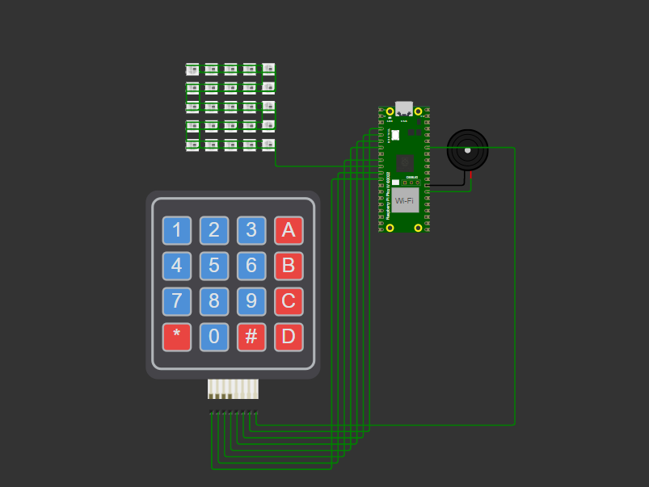

# Embarca Animações [Unidade 03 - Capitulo 04] Subgrupo 2


##### **Para assistir o resultado do projeto [CLIQUE AQUI](https://www.youtube.com/watch?v=R1gO279KbFg)**
##### **Observe abaixo o hardware simulado.**



#### Esse projeto consiste em apresentar diferentes animações nos LEDS dependendo da tecla acionada. Por exemplo, nesse projeto ao pressionar a: 
 - Tecla 0 (Cobrinha)
 - Tecla 1 (Onda Azul) - *Buzzer toca durante toda a animação*
 - Tecla 2 (Explosão) - *Buzzer é acionado*
 - Tecla 3 (Explosão de cores) - *Buzzer é acionado*
 - Tecla 4 (Corrida) - *Buzzer é acionado*
 - Tecla 5 (Inspirar e expirar)
 - Tecla 6 (Contagem regressiva de 10 - 0)
 - Tecla 7 (Espiral) - *Buzzer é acionado*
 - Tecla 8 (Barra caindo) - *Buzzer é acionado*
 - Tecla 9 (Implosão) - *Buzzer é acionado*
 - Tecla B (LEDS ficam **azuis** com **100%** de intensidade) - *Buzzer é acionado*
 - Tecla C (LEDS ficam **vermelhos** com **80%** de intensidade) - *Buzzer é acionado*
 - Tecla D (LEDS ficam **verdes** com **50%** de intensidade) - *Buzzer é acionado*
 - Tecla # (LEDS ficam **brancos** com **20%** de intensidade) - *Buzzer é acionado*
 #### E algumas teclas possuem funcionalidades como:
 - Tecla * (Habilita o modo de gravação)
 - Tecla A (Desliga todos os LEDS) - *Buzzer acionando. Não é possível apagar todos os LEDs de uma animações enquanto ela estiver em andamento.*
 

## Pré-requisitos para abrir o projeto

Para configurar o ambiente de desenvolvimento, siga as instruções abaixo:

### 1. Instalar o Visual Studio Code
- Acesse o site oficial e faça o download: [Visual Studio Code](https://code.visualstudio.com/).
- Instale o programa e configure conforme necessário.
- Adicione a extensão [Wokwi](https://marketplace.visualstudio.com/items?itemName=Wokwi.wokwi-vscode) e faça sua integração com o VS CODE para simular o hardware.

### 2. Instalar o CMake
- Baixe o instalador do CMake: [CMake](https://cmake.org/download/).
- Durante a instalação, marque a opção **"Add CMake to the system PATH"**.
- Conclua a instalação.

### 3. Instalar o GCC para ARM
- Baixe o compilador ARM GNU em: [GCC ARM Toolchain](https://developer.arm.com/tools-and-software/open-source-software/developer-tools/gnu-toolchain/gnu-rm).
- Após a instalação, adicione o diretório do executável ao **PATH**:
  - Vá para **Configurações do Sistema > Variáveis de Ambiente**.
  - Edite a variável `Path` e adicione:
    ```
    C:\Program Files (x86)\Arm GNU Toolchain\<versão>\bin
    ```
  - Substitua `<versão>` pela versão instalada.

### 4. Instalar o Git
- Faça o download: [Git para Windows](https://git-scm.com/).
- Instale o programa e configure-o.
- Abra o terminal (Git Bash ou CMD) e configure seu nome e e-mail:
  ```bash
  git config --global user.name "Seu Nome"
  git config --global user.email "seu.email@exemplo.com"

### 5. Instale o Raspberry Pi Pico SDK 
- Faça o download aqui: [Pico Setup Windows](https://github.com/raspberrypi/pico-setup-windows?tab=readme-ov-file).

## Para testar o projeto em uma placa fisica siga as seguintes instruções:
```bash
# No arquivo: neopixel_pio.c 
Comente essa linha de código: char key = scan_keypad();
Desfaça o comentario dessas linhas: //char key; e //scanf("%c", &key);
```
